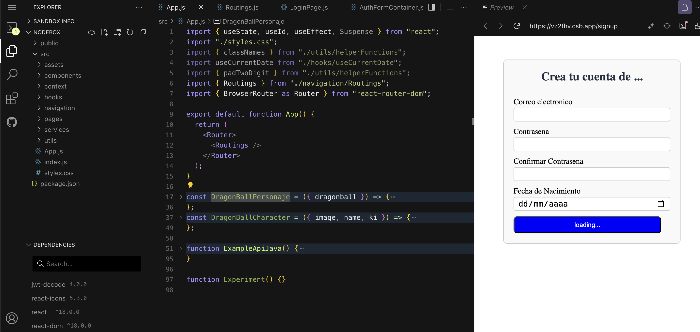
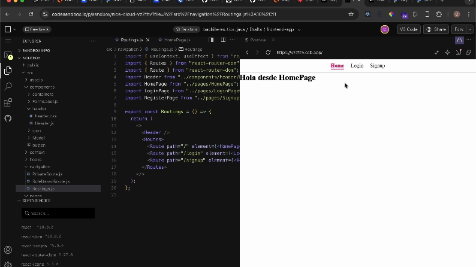

# Practicas-react

Practica 1
Abre codesandbox
Crear una cuenta usando la cuenta de github creada anteriormente.
https://codesandbox.io/signin?utm_source=landingpage
Iniciar y/o crear cuenta con la cuenta de Github


Seguir los pasos y seleccionar cuenta gratuita. (Free)

Crea un proyecto React con el boton Create


Usa en el proyecto React sin TS


Crea la siguiente estructura:



En la parte donde dice dependencias:
Anade:

1. jwt-decode
2. react-router-dom
3. react-icons
4. react-dates
5. Investigar as dependencias que crean necesitar, que sean pocas, ya que tardara en cargar la app mas tiempo.

Crear las rutas para la applicacion. En la carpeta navigation
Anadir las siguientes archivos:


En la carpeta pages
Crear las vistas que tendra la aplicacion:


Poner algun contenido en las paginas: 

En el archivo Routings.js iran las rutas de la aplicacion, que disenaran.
Importar los componentes vista y estructurarlos como en el ejemplo
Copia y pega este codigo, pero dale el nombre que quieras para la ruta. Ejemplo: "/login" y anade en HomePage el componente que se vera al visitar 
la ruta. Ejemplo: <LoginPage />

```JavaScript
import React from 'react'
import { Routes } from "react-router-dom";
import { Route } from "react-router-dom";
import HomePage from "../pages/HomePage";
import LoginPage from "../pages/LoginPage";
import RegisterPage from "../pages/SignupPage";

export const Routings = () => {
  return (
    <Routes>
      <Route path="/" element={<HomePage />} />
      <Route path="/login" element={<LoginPage />} />
      <Route path="/signup" element={<RegisterPage />} />
    </Routes>
  )
}
```

En cada archivo en pages, colocar el siguiente contenido, asegurandose que el nombre del archivo coincida con el de la funcion y el export default y el texto despues de Hola desde...
Ejemplo: HomePage.js

```JavaScript
import React from "react";

function HomePage() {
  return (
    <div>
      <h2>Hola desde HomePage</h2>
    </div>
  );
}

export default HomePage
```

En el archivo App.js, Anadir lo que hace falta, para que se vea asi:

```JavaScript
import { Routings } from "./navigation/Routings";
import { BrowserRouter as Router } from "react-router-dom";

export default function App() {
  return (
    <Router>
      <Routings />
    </Router>
  );
}
```

En el componente que sea la pagina de inicio, anadir el componente header para poder navegar desde ahi.
Dentro de la carpeta components, crear la carpeta header y anadir Header.js y header.css

```JavaScript
import React from "react";
import { Link, useLocation } from "react-router-dom";
import "./header.css";

function Header() {
  const location = useLocation();

  return (
    <header className="header">
      <nav className="nav">
        <Link
          to="/"
          className={`nav-link ${location.pathname === "/" ? "active" : ""}`}
        >
          Home
        </Link>
        <Link
          to="/login"
          className={`nav-link ${
            location.pathname === "/login" ? "active" : ""
          }`}
        >
          Login
        </Link>
        <Link
          to="/signup"
          className={`nav-link ${
            location.pathname === "/signup" ? "active" : ""
          }`}
        >
          Signup
        </Link>
      </nav>
    </header>
  );
}

export default Header
```
En el archivo Routings, importar el Header.js. Y hacer que se vea como:

```JavaScript
export const Routings = () => {
  return (
    <>
      <Header />
      <Routes>
        <Route path="/" element={<HomePage />} />
        <Route path="/login" element={<LoginPage />} />
        <Route path="/signup" element={<RegisterPage />} />
      </Routes>
    </>
  );
}
```

El resultado seria:



Subir usando github pages:
Seguir las siguientes instrucciones:

* Guardar el enlace generado al sitio.

Recursos react

Recursos css


Recursos html

Recursos Git 
//anade todos los archivos que se han modificado
git add . 
// Anadir un mensaje 
git commit -m "mensaje" --> estructura: 

git push origin -m main
